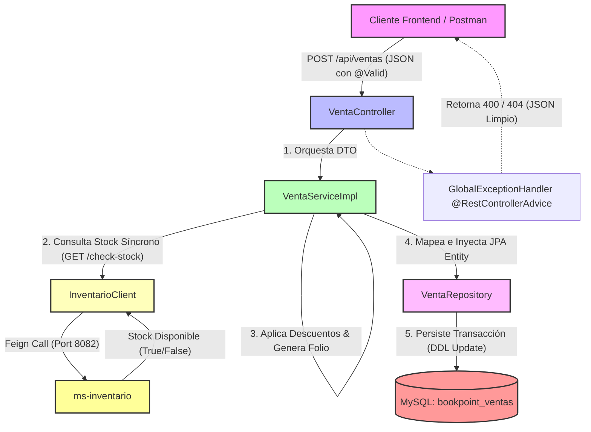

# Microservicio ms-ventas - BookPoint Chile
> **Área:** Gestión de Transacciones de Caja y Venta Online  
> **Arquitectura:** Microservicios con Spring Boot (Java 17) bajo Patrón CSR  
> **Puerto por Defecto:** `8081`

---

## 1. Visión General y Responsabilidades

El microservicio **`ms-ventas`** actúa como el núcleo transaccional financiero del ecosistema de **BookPoint Chile**. Este componente es responsable de consolidar de forma consistente e inmutable cualquier compra de libros, artículos de papelería o material educativo, operando bajo dos canales de negocio clave:

*   **Ventas Físicas (Presenciales en Caja):** Utilizadas por el **"Asistente de Ventas"** en sucursales físicas (Concepción, Temuco, La Serena). Requiere de forma obligatoria el registro del operador de caja (`asistenteNombre`) y permite la aplicación de convenios de descuento físicos (como convenios estudiantiles).
*   **Ventas Online (E-commerce):** Utilizadas por el **"Cliente Web"** de forma directa en el portal. Omiten los datos del asistente y permiten la inyección de cupones de descuento web promocionales.

### 🛡️ Reglas de Negocio Críticas Controladas en la Capa Service:
1.  **Validación de Caja:** Si la venta es de tipo `PRESENCIAL`, es obligatorio ingresar el campo `asistenteNombre`. De lo contrario, se aborta la transacción y se arroja un error 400.
2.  **Motor de Descuentos Flexible:**
    *   **15% de Descuento:** Código `CONVENIO_ESTUDIANTIL` o `ESTUDIANTE15` (Convenio estudiantil físico).
    *   **10% de Descuento:** Código `DESCUENTO10` (Cupón digital estándar).
    *   **20% de Descuento:** Código `PROMO20` (Cupón de campaña especial).
3.  **Auditoría e Inmutabilidad (Folio Único):** Se genera de manera transaccional un folio único con prefijo del canal (`BP-PRE-XXXXXXXX` o `BP-ONL-XXXXXXXX`) utilizando `UUID` para trazabilidad de boletas.
4.  **Consistencia de Stock en Red (Interoperabilidad Síncrona):** Antes de persistir la venta, el servicio se comunica vía **Feign Client** con el microservicio `ms-inventario` (puerto `8082`) para garantizar que existan existencias físicas en el sistema centralizado de inventario.

---

## 2. Diagrama de Arquitectura y Flujo (CSR Pattern)

A continuación, se detalla el flujo de datos bajo el **patrón CSR (Client-Side Rendering)**. El cliente REST (Frontend) interactúa estrictamente mediante JSON con la API REST descentralizada:



---

## 3. Tecnologías Core e Implementación Técnica

El desarrollo se fundamenta en el ecosistema **Spring Cloud** y las especificaciones Java Enterprise para arquitecturas empresariales:

*   **Spring Boot 3.2.5:** Framework base para el bootstrapping y configuración autogestionada (inyección de dependencias, contenedores embebidos y perfiles).
*   **Spring Data JPA (Hibernate):** Gestión de persistencia orientada a objetos. Implementa relaciones bidireccionales `@OneToMany` (en `Venta`) y `@ManyToOne` (en `DetalleVenta`) configurando operaciones en cascada (`CascadeType.ALL`) y remoción de huérfanos (`orphanRemoval = true`).
*   **Spring Cloud OpenFeign:** Abstracción declarativa para llamadas síncronas HTTP. Define la interfaz `InventarioClient` que mapea el canal de comunicación con `ms-inventario`, implementando un patrón tolerante a fallos (`fallback`).
*   **Lombok (Librería Técnica):** Optimiza el código eliminando el boilerplate a través de anotaciones `@Getter`, `@Setter`, `@Builder`, `@NoArgsConstructor` y `@AllArgsConstructor`.
*   **JSR 380 (Bean Validation 3.0):** Intercepta peticiones malformadas a nivel controlador a través de anotaciones de validación `@NotNull`, `@Min`, `@NotEmpty` y `@NotBlank`.
*   **SLF4J (Logback):** Integrado nativamente mediante `@Slf4j` en el `Service`. Genera trazabilidad de auditorías críticas en consola y registros históricos.

---

## 4. Documentación de Endpoints REST

La API se expone de forma headless y cuenta con soporte total de CORS habilitado (`@CrossOrigin`) para integraciones ágiles con frontends basados en React, Angular o Vue.

| Método HTTP | Endpoint | Descripción | Códigos HTTP de Respuesta |
| :--- | :--- | :--- | :--- |
| **POST** | `/api/ventas` | Registra una nueva venta (física u online), valida stock vía Feign y persiste la boleta con folios únicos. | `201 Created` (Éxito)<br>`400 Bad Request` (RUT inválido, falta asistente en caja, stock insuficiente)<br>`500 Internal Error` |
| **GET** | `/api/ventas/{folio}` | Recupera una venta específica y todo su detalle de artículos utilizando su código de folio único. | `200 OK` (Éxito)<br>`404 Not Found` (El folio de venta no existe) |
| **GET** | `/api/ventas` | Obtiene el listado histórico consolidado de todas las ventas registradas. | `200 OK` (Éxito) |

---

## 5. Pruebas de Integración (Postman)

### ✅ Happy Path: Registro Exitoso de Venta en Caja con Descuento Estudiantil
*   **Método:** `POST`
*   **URL:** `http://localhost:8081/api/ventas`
*   **Body (JSON Raw):**
```json
{
  "tipoVenta": "PRESENCIAL",
  "clienteNombre": "Renato Duoc",
  "clienteRut": "12.345.678-9",
  "asistenteNombre": "Diego López",
  "codigoDescuento": "CONVENIO_ESTUDIANTIL",
  "detalles": [
    {
      "productoId": 101,
      "productoNombre": "Introducción a los Algoritmos en Java",
      "cantidad": 2,
      "precioUnitario": 25000.00
    }
  ]
}
```
*   **Efecto:** El sistema llamará a `ms-inventario` para confirmar el stock de la obra `101`. Al ser exitoso, aplicará el **15%** de descuento sobre el subtotal ($50,000) arrojando un total de **$42,500** y persistiendo la venta bajo un folio único `BP-PRE-XXXXXXXX`.

---

### ❌ Flujo de Error: Intento de Compra con Stock Agotado (Código 999)
*   **Método:** `POST`
*   **URL:** `http://localhost:8081/api/ventas`
*   **Body (JSON Raw):**
```json
{
  "tipoVenta": "ONLINE",
  "clienteNombre": "Comprador Web",
  "clienteRut": "98.765.432-1",
  "codigoDescuento": "DESCUENTO10",
  "detalles": [
    {
      "productoId": 999,
      "productoNombre": "Libro de Algoritmos Avanzados (Agotado)",
      "cantidad": 1,
      "precioUnitario": 35000.00
    }
  ]
}
```
*   **Efecto:** El microservicio interroga a `ms-inventario`. Al recibir una señal de indisponibilidad para el ID `999`, el servicio interrumpe el hilo transaccional, genera un log de error y el `@RestControllerAdvice` (`GlobalExceptionHandler`) responde con **HTTP 400 Bad Request** y el siguiente JSON estructurado:

```json
{
  "timestamp": "2026-05-24T17:23:45.123456",
  "status": 400,
  "error": "Bad Request",
  "message": "El producto 'Libro de Algoritmos Avanzados (Agotado)' (ID: 999) no tiene stock suficiente. Disponible simulado: 0",
  "path": "/api/ventas",
  "details": null
}
```

### ⚙️ El Rol del Fallback Simulado en Feign
En arquitecturas distribuidas, si el servicio destino (`ms-inventario`) está fuera de línea, la llamada Feign fallaría abruptamente. Para evitar esto, `ms-ventas` incorpora `InventarioClientFallback.java`. Este componente actúa como un **disyuntor lógico (Circuit Breaker)**: intercepta las llamadas fallidas y responde con lógica preprogramada. En este caso, simula que el ID `999` nunca tiene stock disponible y que el resto de los artículos tienen disponibilidad ilimitada, permitiendo continuar con defensas académicas e integraciones de prueba de forma fluida y sin caídas de red.

---

## 6. Instrucciones de Ejecución

### Requisitos Previos:
1.  **Java JDK 17** instalado y configurado en las variables de entorno.
2.  **Apache Maven 3.8+** o wrapper integrado.
3.  **MySQL Server** en ejecución local o remota.

### Configuración del Entorno:
1.  Asegúrate de contar con la base de datos `bookpoint_ventas` en tu motor MySQL:
    ```sql
    CREATE DATABASE bookpoint_ventas;
    ```
2.  Verifica las credenciales de conexión en el archivo [application.properties](src/main/resources/application.properties):
    ```properties
    spring.datasource.url=jdbc:mysql://localhost:3306/bookpoint_ventas?createDatabaseIfNotExist=true&useSSL=false&serverTimezone=UTC
    spring.datasource.username=root
    spring.datasource.password=tu_contraseña
    ```

### Ejecutar el Microservicio:
Abre una terminal en la raíz del microservicio `ms-ventas` (`C:\Users\renat\OneDrive\Documentos\Duoc\Fullstack I\Bookpoint\ms-ventas`) y ejecuta el comando de arranque de Spring Boot:

```bash
mvn clean spring-boot:run
```

El servicio iniciará en el puerto **`8081`** y estará listo para recibir peticiones JSON desde Postman, cimentando la capa financiera del e-commerce.
